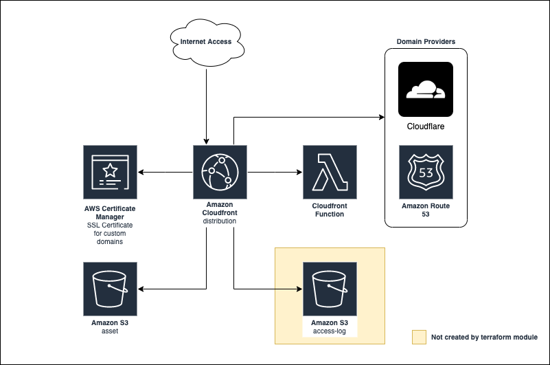

# AWS Static Website Terraform module

This Terraform module provisions a static website using AWS S3 and CloudFront with optional custom domain support.



## Usage

### Without Custom Domain
```
module "static-website" {
  source = "git@github.com:aashari/terraform-aws-static-website.git"
  name   = "test.ashari.me"
}
```
The code above will provide an S3 bucket and a Cloudfront Distribution serving static assets in an S3 bucket

### With Custom Domain Cloudflare
```
module "static-website" {
  source                  = "git@github.com:aashari/terraform-aws-static-website.git"
  name                    = "hello.ashari.me"
  custom_domain_provider  = "CLOUDFLARE"
  custom_domain_records   = ["hello", "www.hello"]
  custom_domain_zone_id   = "abcdefghijklmnopqrstuvwxyz12345"
  cloudflare_api_token    = "AaaA11AaaaAaaA1aa11AAa11A76aaAAa9aAAaa-a"
}
```
The code above will provide an S3 bucket and Cloudfront Distribution serving static assets in an S3 bucket with additional ACM certificates for the custom domains assigned to Cloudfront and creating new records in the Cloudflare Zone

### With Custom Domain Route53
```
module "static-website" {
  source                  = "git@github.com:aashari/terraform-aws-static-website.git"
  name                    = "hello.ashari.me"
  custom_domain_provider  = "ROUTE53"
  custom_domain_records   = ["hello", "www.hello"]
  custom_domain_zone_id   = "Z0ABCDEFGHI1234567"
}
```
The code above will provide an S3 bucket and Cloudfront Distribution serving static assets in an S3 bucket with additional ACM certificates for the custom domains assigned to Cloudfront and creating new records in the Route53 Zone

### With CloudFront Function

#### main.tf
```
module "static-website" {
  source                        = "git@github.com:aashari/terraform-aws-static-website.git"
  name                          = "ashari.tech"
  cloudfront_function_file_path = "function.js"
  cloudfront_function_runtime   = "cloudfront-js-1.0"
  cloudfront_function_type      = "viewer-request"
}

```
The code above will provide an S3 bucket and a Cloudfront Distribution serving static assets in an S3 bucket with additional CloudFront function ([function.js](examples/with-cloudfront-function/function.js)) which redirect www request to non-www request

### With CloudFront Access Logs

#### main.tf
```
module "static-website" {
  source                                = "git@github.com:aashari/terraform-aws-static-website.git"
  name                                  = "ashari.tech"
  cloudfront_access_log_bucket          = "default-cloudfront-access-logs-ap-southeast-1-1234567890"
  cloudfront_access_log_enable_cookies  = true
}

```
The code above will provide an S3 bucket and a Cloudfront Distribution serving static assets in an S3 bucket with additional configuration on logging the access logs into the S3 bucket

## Features

- S3 bucket for static asset storage
- CloudFront distribution for content delivery
- Optional custom domain support (Cloudflare or Route53)
- Optional CloudFront function
- Optional CloudFront access logging

## Requirements

| Name | Version |
|------|---------|
| <a name="requirement_terraform"></a> [terraform](#requirement\_terraform) | ~> 1.9.6 |
| <a name="requirement_aws"></a> [aws](#requirement\_aws) | ~> 5.68.0 |
| <a name="requirement_random"></a> [random](#requirement\_random) | ~> 3.6.3 |
| <a name="requirement_cloudflare"></a> [cloudflare](#requirement\_cloudflare) | ~> 4.0 |

## Providers

| Name | Version |
|------|---------|
| <a name="provider_aws"></a> [aws](#provider\_aws) | ~> 5.68.0 |
| <a name="provider_random"></a> [random](#provider\_random) | ~> 3.6.3 |
| <a name="provider_cloudflare"></a> [cloudflare](#provider\_cloudflare) | ~> 4.0 |

## Inputs

| Name | Description | Type | Default | Required |
|------|-------------|------|---------|:--------:|
| <a name="input_name"></a> [name](#input\_name) | Name of the static website stacks.<br />For example: `my-website`, `my-website-staging`, `ashari.com`, `andi.ashari.me` | `string` | `""` | yes |
| <a name="input_default_tags"></a> [default\_tags](#input\_default\_tags) | Default tags to apply to all resources | `map(string)` | `{}` | no |
| <a name="input_default_root_object"></a> [default\_root\_object](#input\_default\_root\_object) | Default root object to serve | `string` | `index.html` | no |
| <a name="input_default_not_found_page"></a> [default\_not\_found\_page](#input\_default\_not\_found\_page) | Default not found page | `string` | `index.html` | no |
| <a name="input_cloudfront_access_log_bucket"></a> [cloudfront\_access\_log\_bucket](#input\_cloudfront\_access\_log\_bucket) | Cloudfront access log bucket name | `string` |`""`| no |
| <a name="input_cloudfront_access_log_enable_cookies"></a> [cloudfront\_access\_log\_enable\_cookies](#input\_cloudfront\_access\_log\_enable\_cookies) | Enable CloudFront access logs to include cookies | `bool` | `true` | no |
| <a name="input_cloudfront_function_file_path"></a> [cloudfront\_function\_file\_path](#input\_input\_cloudfront\_function\_file\_path) | Path to the CloudFront function file | `string` |`""`| no |
| <a name="input_cloudfront_function_runtime"></a> [cloudfront\_function\_runtime](#input\_input\_cloudfront\_function\_runtime) | CloudFront function runtime | `string` | `cloudfront-js-1.0` | no |
| <a name="input_cloudfront_function_type"></a> [cloudfront\_function\_type](#input\_input\_cloudfront\_function\_type) | CloudFront function event type to trigger | `string` | `viewer-request` | no |
| <a name="input_custom_domain_provider"></a> [custom\_domain\_provider](#input\_custom\_domain\_provider) | Custom domain provider name. <br />Available values: `CLOUDFLARE`, `ROUTE53` | `string` | `""` | no |
| <a name="input_custom_domain_records"></a> [custom\_domain\_records](#input\_custom\_domain\_records) | Custom domain records name to use for CloudFront distribution, use `@` to use the zone domain name.<br />For example `["hello", "www.hello"]` which represent `hello.{{ROOT_DOMAIN}}` and `www.hello.{{ROOT_DOMAIN}}`<br />or `["@", "www"]` which represent `{{ROOT_DOMAIN}}` and `www.{{ROOT_DOMAIN}}`.<br />where `ROOT_DOMAIN` is coming from domain name from Zone provided in `custom_domain_zone_id` variable  | `list(string)` | `[]` | yes if <a name="input_custom_domain_provider"></a> [custom\_domain\_provider](#input\_custom\_domain\_provider) is not empty  |
| <a name="input_custom_domain_zone_id"></a> [custom\_domain\_zone\_id](#input\_custom\_domain\_zone\_id) | Domain Provider zone ID which custom domain is registered to.<br />In Cloudflare this is called Zone Id, in Route53 this is called Hosted Zone Id  | `string` | `""` | yes if <a name="input_custom_domain_provider"></a> [custom\_domain\_provider](#input\_custom\_domain\_provider) is not empty  |
| <a name="input_custom_domain_ttl"></a> [custom\_domain\_ttl](#input\_custom\_domain\_ttl) | Custom domain TTL  | `number` | `300` | no |
| <a name="input_cloudflare_api_token"></a> [cloudflare\_api\_token](#input\_cloudflare\_api\_token) | Cloudflare API token  | `string` | `""` | yes if <a name="input_custom_domain_provider"></a> [custom\_domain\_provider](#input\_custom\_domain\_provider) is equal to `CLOUDFLARE`  |

## Outputs

| Name | Description |
|------|-------------|
| <a name="output_s3_bucket_name"></a> [s3\_bucket\_name](#output\_s3\_bucket\_name) | S3 bucket name |
| <a name="output_cloudfront_distribution_domain_name"></a> [cloudfront\_distribution\_domain\_name](#output\_cloudfront\_distribution\_domain\_name) | CloudFront distribution domain name |

## Contributing

Contributions are welcome! Please feel free to submit a Pull Request.

## License

This project is licensed under the Apache 2.0 License - see the [LICENSE](LICENSE) file for details.
