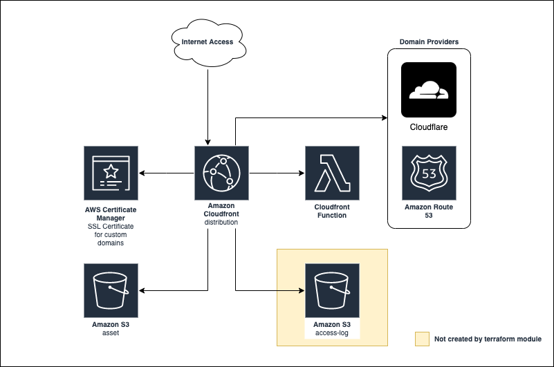

# AWS Static Website Terraform Module


A comprehensive Terraform module for provisioning static websites using AWS S3 and CloudFront with flexible configuration options.

## Overview

This module simplifies the deployment of static websites on AWS by providing a reusable Terraform configuration. It handles S3 bucket creation, CloudFront distribution setup, custom domain configuration, CloudFront functions, and access logging.



## Features

- **S3 bucket** for static asset storage
- **CloudFront distribution** for content delivery
- **Optional custom domain support** (Cloudflare or Route53)
- **Optional CloudFront function** for request manipulation
- **Optional CloudFront access logging**
- **S3 bucket versioning**

## Architecture

The module creates and manages the following resources:

- **S3 Bucket**: Private bucket for hosting static website files
- **CloudFront Distribution**: CDN for delivering content with HTTPS
- **CloudFront Origin Access Identity**: Secure access to the S3 bucket
- **ACM Certificate**: (Optional) For custom domains
- **DNS Records**: (Optional) For custom domain mapping via Cloudflare or Route53
- **CloudFront Function**: (Optional) For request/response manipulation

## Requirements

| Name       | Version            |
| ---------- | ------------------ |
| terraform  | >= 1.11.1, < 2.0.0 |
| aws        | >= 5.92.0, < 6.0.0 |
| random     | >= 3.6.3, < 4.0.0  |
| cloudflare | >= 5.20.0, < 6.0.0 |

## Usage

### Basic Usage (Without Custom Domain)

```hcl
module "static_website" {
  source = "github.com/aashari/terraform-aws-static-website?ref=v4.0.0"
  name   = "my-static-website"
}
```

### With Custom Domain (Cloudflare)

```hcl
module "static_website" {
  source                 = "github.com/aashari/terraform-aws-static-website?ref=v4.0.0"
  name                   = "my-static-website"
  custom_domain_provider = "CLOUDFLARE"
  custom_domain_records  = ["@", "www"]
  custom_domain_zone_id  = "abcdefghijklmnopqrstuvwxyz12345"
  cloudflare_api_token   = "your-cloudflare-api-token"
}
```

### With Custom Domain (Route53)

```hcl
module "static_website" {
  source                 = "github.com/aashari/terraform-aws-static-website?ref=v4.0.0"
  name                   = "my-static-website"
  custom_domain_provider = "ROUTE53"
  custom_domain_records  = ["@", "www"]
  custom_domain_zone_id  = "Z0ABCDEFGHI1234567"
}
```

### With CloudFront Function

```hcl
module "static_website" {
  source                        = "github.com/aashari/terraform-aws-static-website?ref=v4.0.0"
  name                          = "my-static-website"
  cloudfront_function_file_path = "path/to/function.js"
  cloudfront_function_runtime   = "cloudfront-js-1.0"
  cloudfront_function_type      = "viewer-request"
}
```

### With CloudFront Access Logs

```hcl
module "static_website" {
  source                               = "github.com/aashari/terraform-aws-static-website?ref=v4.0.0"
  name                                 = "my-static-website"
  cloudfront_access_log_bucket         = "my-access-logs-bucket"
  cloudfront_access_log_enable_cookies = true
}
```

## Inputs

| Name                                 | Description                                              | Type           | Default               | Required |
| ------------------------------------ | -------------------------------------------------------- | -------------- | --------------------- | :------: |
| name                                 | Name of the static website stack                         | `string`       | n/a                   |   yes    |
| default_tags                         | Default tags to apply to all resources                   | `map(string)`  | `{}`                  |    no    |
| default_root_object                  | Default root object to serve                             | `string`       | `"index.html"`        |    no    |
| default_not_found_page               | Default not found page                                   | `string`       | `"index.html"`        |    no    |
| cloudfront_access_log_bucket         | CloudFront access log bucket name                        | `string`       | `""`                  |    no    |
| cloudfront_access_log_enable_cookies | Enable CloudFront access logs to include cookies         | `bool`         | `true`                |    no    |
| cloudfront_function_file_path        | Path to the CloudFront function file                     | `string`       | `""`                  |    no    |
| cloudfront_function_runtime          | CloudFront function runtime                              | `string`       | `"cloudfront-js-1.0"` |    no    |
| cloudfront_function_type             | CloudFront function event type to trigger                | `string`       | `"viewer-request"`    |    no    |
| custom_domain_provider               | Custom domain provider name (CLOUDFLARE or ROUTE53)      | `string`       | `""`                  |    no    |
| custom_domain_records                | Custom domain records to use for CloudFront distribution | `list(string)` | `[]`                  |    no    |
| custom_domain_zone_id                | Domain Provider zone ID for the custom domain            | `string`       | `""`                  |    no    |
| custom_domain_ttl                    | Custom domain TTL                                        | `number`       | `300`                 |    no    |
| cloudflare_api_token                 | Cloudflare API token                                     | `string`       | `""`                  |    no    |
| enable_s3_versioning                 | Enable versioning on the S3 bucket                       | `bool`         | `true`                |    no    |

## Outputs

| Name                                | Description                         |
| ----------------------------------- | ----------------------------------- |
| s3_bucket_name                      | S3 bucket name                      |
| cloudfront_distribution_domain_name | CloudFront distribution domain name |

## License

This project is licensed under the MIT License - see the LICENSE file for details.
